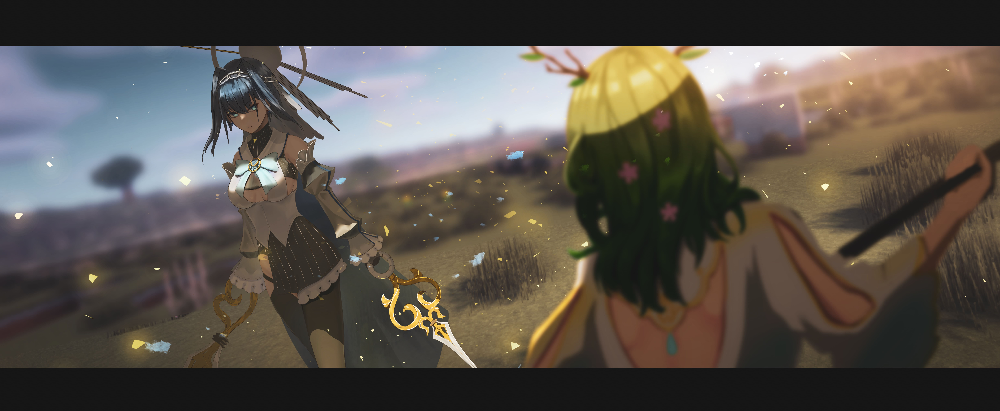

<!-- <div align="center">
  
</div> -->

<br clear="both">

<h1 align="center">Hi 👋! My name is Aditya, I'm a Web Developer and Game Developer, from Indonesia.</h1>

###

<br clear="both">

<div align="center">
  <a href="https://www.linkedin.com/in/aditya-kurnia-saputra/" target="_blank">
    
  </a>
  <a href="https://discord.com/users/962059166925598833" target="_blank">
    
  </a>
  <a href="https://www.instagram.com/dikrcy/" target="_blank">
    
  </a>
</div>

###

<h3 align="center">About Me</h3>

```Ruby
class Developer
  def initialize
    @name = "🧑‍💻 Aditya Kurnia Saputra"
    @location = "📍 Indonesia"
    @occupation = "💻 Web Developer"
    @interests = ["Frontend Development", "Backend Development", "Game Development", "Linux", "OSS"]
    @education = {
      major: "Software Engineering",
      school: "🏫 SMK Plus Pelita Nusantara",
      status: "🧑‍🎓 Grade 12 "
    }
  end

  def introduce
    puts "Hello there! 👋"
    puts "I'm #{@name}, a #{@occupation} from #{@location}."
    puts "I love #{@interests.join(', ')}."
  end
end

kurnias = Developer.new
kurnias.introduce

```

###

```Ruby
tech = {
  frontend: [
    "HTML5", "CSS3",
    "Tailwind CSS", "Bootstrap",
    "Vue.js", "Nuxt", "React"
  ],

  backend: [
    "PHP", "Laravel", 
    "Node.js", "Hono"
  ],

  database: [
    "MySQL", "SQLite", "PostgreSQL"
  ],

  languages: [
    "Ruby", "GDScript",
    "JavaScript", "TypeScript"
  ],

  tools: [
    "VS Code", "Zed", "Figma",
    "Linux", "Git", "GitHub",
    "Composer", "NPM", "PNPM",
    "Deno", "Bun", "Vite"
  ],

  game_engine: [
    "Godot", "Unity"
  ]
}

tech.each do |category, items|
  puts "#{category.to_s.capitalize}: #{items.join(', ')}"
end
```

###

<div align="center">
  
  
  
  
  
</div>

###

<br clear="both">

<div align="center">
  
</div>

###
